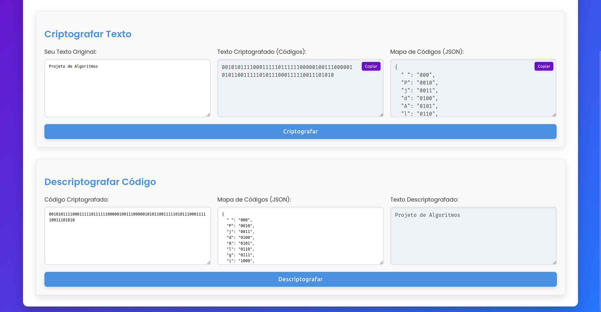
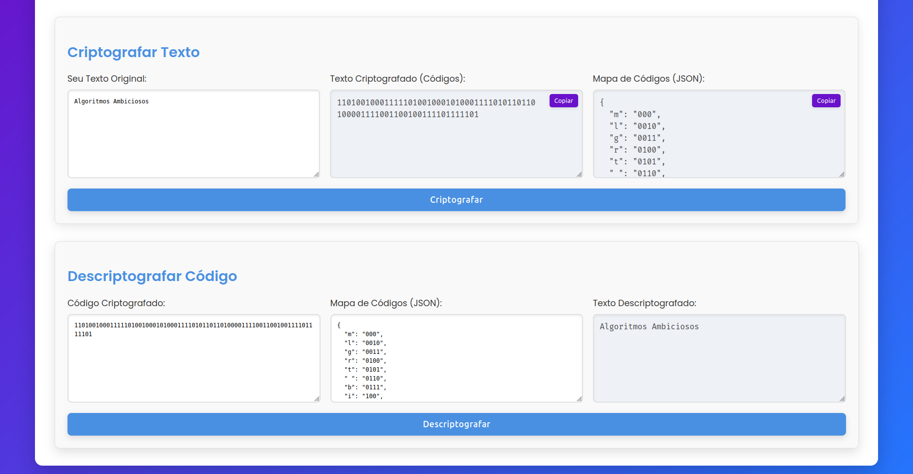
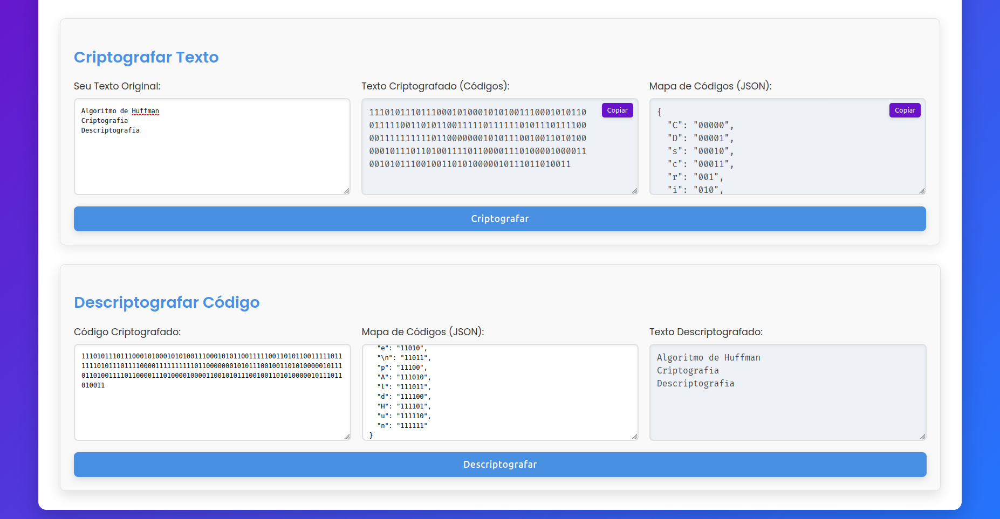

# Codificador/Decodificador Huffman

**Número da Lista**: X<br>
**Conteúdo da Disciplina**: Algoritmos Ambiciosos<br>

## Alunos
|Matrícula | Aluno |
| -- | -- |
| 22/2025324  |  João Lucas Araujo Siqueira |
|22/2015248  | Rafael Gomes Pereira |

## Sobre 

Este projeto implementa um codificador e decodificador utilizando o algoritmo de Huffman, uma técnica eficiente de compressão de dados baseada na frequência de ocorrência dos símbolos. O objetivo é reduzir o tamanho de arquivos de texto, codificando caracteres mais frequentes com sequências de bits menores e menos frequentes com sequências maiores. O sistema permite ao usuário inserir um texto, gerar a árvore de Huffman correspondente, visualizar a codificação de cada caractere e realizar tanto a compressão quanto a descompressão dos dados. O projeto foi desenvolvido como parte dos estudos sobre algoritmos ambiciosos, destacando a aplicação prática do algoritmo de Huffman.

### **Vídeo:** [https://youtu.be/cmlAm0MRszU](https://youtu.be/cmlAm0MRszU)

### **Deploy:** [https://projeto-de-algoritmos-2025.github.io/AlgoritmosAmbiciosos_Codificador-Decodificador/](https://projeto-de-algoritmos-2025.github.io/AlgoritmosAmbiciosos_Codificador-Decodificador/)

## Screenshots








## Instalação 
**Linguagem**: JavaScript<br>
**Framework**: Nenhum<br>
### Pré-requisitos

- [Git](https://git-scm.com/)
- Navegador web moderno (Chrome, Firefox, Edge, etc.)

### Como rodar

#### **Acesse a aplicação em produção:** [https://projeto-de-algoritmos-2025.github.io/AlgoritmosAmbiciosos_Codificador-Decodificador/](https://projeto-de-algoritmos-2025.github.io/AlgoritmosAmbiciosos_Codificador-Decodificador/)

Ou, se preferir:

1. Clone o repositório:
    ```bash
    git clone https://github.com/projeto-de-algoritmos-2025/AlgoritmosAmbiciosos_Codificador-Decodificador.git
    ```
2. Acesse a pasta do projeto:
    ```bash
    cd AlgoritmosAmbiciosos_Codificador-Decodificador
    ```
3. Abra o arquivo `index.html` no seu navegador.


## Uso 

Para utilizar o codificador/decodificador Huffman, siga os passos abaixo:

1. Abra o arquivo `index.html` ou acesse o link: []()
2. Insira o texto a ser criptografado no campo indicado e clique em `Criptografar`.
3. Veja o código binário criptografado e o mapeamento do código de cada letra nos campos indicados. Esses valores podem ser copiados clicando no botão `Copiar`.
4. Para descriptografar, insira o código e o mapeamento das letras nos campos indicados e clique no botão `Descriptografar`. O texto será exibido no campo indicado.


